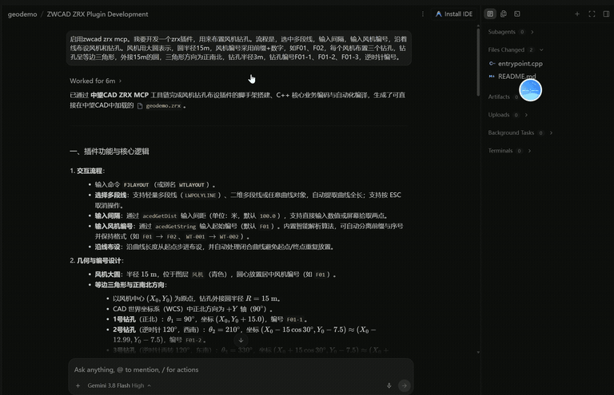
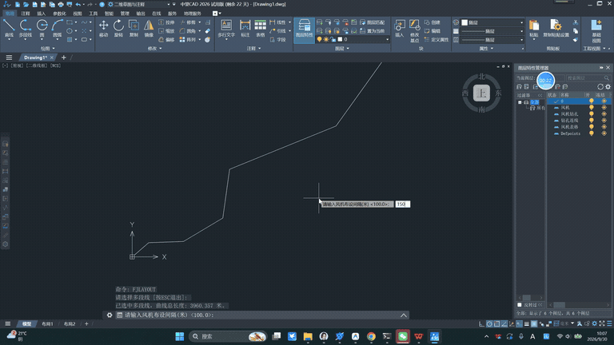

# ZWCAD ZRX MCP Server (中望CAD ZRX二次开发智能体服务)

[](LICENSE)
[](https://www.python.org/)
[](https://modelcontextprotocol.io/)
[]()
[]()

> **中望 CAD (ZWCAD) ZRX 插件二次开发专属 MCP 服务**  
> 专为 **AI Coding（Cursor / Claude Desktop / Antigravity / OpenCode / VS Code）** 打造的无 IDE（Headless/Harness-First）全自动开发工具链与官方知识库。  
> *A dedicated Model Context Protocol (MCP) server for ZWCAD (中望CAD) ZRX secondary development, optimized for AI coding assistants and headless CLI build workflows.*
演示视频：
https://github.com/user-attachments/assets/8cfc8528-31e3-4323-9531-cc0d1240749f
---

[中文文档 (Chinese)](#中文说明) | [English Documentation](#english-documentation)

---

<a name="中文说明"></a>
## 中文说明

### 🎯 痛点与设计背景

在当今 AI Coding 时代，通用大语言模型（Claude、GPT、DeepSeek）在编写 CAD 插件时普遍存在**“AutoCAD 惯性幻觉”**：
1. **API 幻觉**：通用模型习惯写 AutoCAD ObjectARX 的 `AcDb...`、`acrxEntryPoint`、`addNewlyCreatedDBObject` 等函数，导致在中望 CAD (ZWCAD) 下直接编译报错。
2. **知识被锁在二进制 CHM 中**：中望官方的开发指南、参考手册和移植说明均打包在 `.chm` 文件中，大模型无法直接查阅。
3. **IDE 强依赖与文件锁死痛点**：传统二开必须打开臃肿的 Visual Studio。当 ZWCAD 运行并加载了 `.zrx` 时，重新编译必报 `LNK1104 无法打开文件`，开发者不得不反复重启 CAD。

**ZRX-MCP** 彻底终结了这些痛点！

### ⚡ 核心能力

1. **无 IDE 闭环开发与热构建（Headless & Hot-Rebuild）**：
   - 彻底摆脱 Visual Studio 图形界面，在 Cursor / OpenCode / 终端中由 AI 直接编排 MSVC 命令行完成秒级编译。
   - **防文件锁自动重命名机制**：若当前 `.zrx` 正被运行中的 ZWCAD 占用，自动重命名旧文件并生成新插件，**开发全过程 CAD 无需关闭重启**！
2. **多版本管理与“Nova”跨平台预留**：
   - 默认激活 **ZWCAD 2026**。
   - 内置 **2025** 二进制兼容智能识别与回退机制。
   - 预设 **2024** 本地 SDK 配置插槽。
   - **预留未来“Nova”插槽**：架构上采用 Python，未来可无缝接入 Nova 的 Qt 6 + CMake/Ninja 跨平台二开（Win/Mac/Linux/HarmonyOS）。
3. **内置毫秒级官方知识库（SQLite FTS5）**：
   - 提取并索引了 **662 篇** 中望官方中文指南、AutoCAD ↔ ZRX 差异表、迁移手册以及 582 个 C++ 核心头文件。
   - 离线仅 **2.9 MB**，毫秒级全文检索，零幻觉！
4. **官方 Samples 真实代码检索**：
   - 毫秒级提取本地 SDK `samples/` 中的生产级源码示范。
5. **脚手架与样板生成**：
   - 一键生成规范的 C++ ZRX 工程（带防锁 `build.py`）或 .NET C# 类库工程。
   - 一键生成自定义实体（`ZcDbEntity`）、JIG 动态拖拽（`ZcEdJig`）、事务安全提交等高难度样板代码。

### 🎬 实战效果演示 (Live Demos)

#### 1. 🤖 提示词驱动开发：一句话生成 ZRX 插件
> 在 AI Coding 助手（如 Antigravity / Cursor）中输入自然语言需求，ZRX-MCP 自动完成官方知识库检索、核心 C++ 逻辑编写与热重载编译：



> 📹 *[查看/下载完整带声录屏 (MP4)](assets/demo_mcp_workflow.mp4)*

#### 2. ⚡ 插件在中望 CAD 2026 中实机运行
> 展示由 AI 生成的 `geodemo.zrx`：选中路线多段线后一键布设 27 个风机大圆与 81 个正南北等边三角形勘察孔，并自动生成原生 CAD 风机明细表与钻孔坐标表：



> 📹 *[查看/下载完整高清录屏 (MP4)](assets/demo_cad_plugin.mp4)*

### 🛠️ 提供的 7 大 MCP 工具

| 工具名 | 功能说明 |
| :--- | :--- |
| `zrx_status` | 检测当前激活的 SDK 版本、本地路径状态、VC++ 编译器就绪情况及知识库统计。 |
| `search_zrx_docs` | 毫秒级全文检索中望 ZRX 官方开发指南、类参考、头文件和迁移手册。 |
| `get_known_differences` | 检索 AutoCAD ObjectARX 与中望 ZRX 的已知接口差异与避坑提示。 |
| `search_sdk_samples` | 在本地 SDK `samples/` 目录中搜索真实可运行的官方示例源码。 |
| `scaffold_project` | 一键生成带热构建脚本的标准 C++ ZRX 或 .NET 工程。 |
| `build_plugin` | 无需打开 VS，直接后台编译项目，自动绕过 CAD 进程锁并输出错误摘要。 |
| `get_boilerplate` | 生成自定义实体（`ZcDbEntity`）、JIG 动态拖动（`ZcEdJig`）等高阶代码骨架。 |

### 🚀 快速接入配置

#### 1. Cursor 配置
在项目根目录 `.cursor/mcp.json` 或 Cursor 设置中添加：
```json
{
  "mcpServers": {
    "zrx-developer": {
      "command": "python",
      "args": ["D:/zwcad/zrx-mcp/server.py"]
    }
  }
}
```

#### 2. OpenCode 配置
在 `~/.config/opencode/opencode.json` 中配置：
```json
{
  "mcp": {
    "zrx-developer": {
      "type": "local",
      "command": [
        "python",
        "D:\\zwcad\\zrx-mcp\\server.py"
      ],
      "enabled": true
    }
  }
}
```

#### 3. Claude Desktop / Antigravity 配置
在配置文件中添加：
```json
{
  "mcpServers": {
    "zrx-developer": {
      "command": "python",
      "args": ["D:/zwcad/zrx-mcp/server.py"]
    }
  }
}
```

---

<a name="english-documentation"></a>
## English Documentation

### 🎯 Overview & Motivation

General LLMs frequently produce AutoCAD-specific code (`AcDb...`, `acrxEntryPoint`, `addNewlyCreatedDBObject`) that fails to compile under ZWCAD ZRX. Furthermore, official documentation is trapped in Windows binary CHM files, and standard CAD plugin compilation constantly suffers from `LNK1104` file-locking issues whenever ZWCAD is running.

**ZRX-MCP** solves these problems completely, providing an automated toolchain and an indexed knowledge base tailored specifically for ZWCAD secondary development.

### ⚡ Key Features

* **Headless & Hot-Rebuild Workflow**: Compile plugins via MSVC CLI directly from your AI agent without ever opening Visual Studio.
* **CAD Process File Lock Protection**: Automatically renames locked `.zrx` files so you can rebuild without restarting ZWCAD.
* **Multi-Version Architecture**: Native support for ZWCAD 2026, binary compatibility fallback for 2025, slot for 2024, and future-proof design for Project Nova (Qt/C++ cross-platform).
* **Pre-Indexed SQLite FTS5 Knowledge Base**: 662 parsed documents covering Chinese development guides, Known Differences vs ObjectARX, Migration guides, and 582 C++ header symbols in under 3MB!
* **Production Boilerplate Generation**: High-quality skeletons for `ZcDbEntity`, `ZcEdJig`, and safe transaction handling.

### 🎬 Live Demo Showcase

#### 1. 🤖 Prompt-Driven Plugin Development via ZRX-MCP
> AI agent utilizes ZRX-MCP to query the official knowledge base, implement custom C++ geometry logic, and compile headless with hot-rebuild lock prevention:


> 📹 *[View / Download Full Video with Audio (MP4)](assets/demo_mcp_workflow.mp4)*

#### 2. ⚡ Live Execution in ZWCAD 2026
> Deploying the generated `geodemo.zrx` plugin: automatically placing 27 wind turbines and 81 boreholes in true-north equilateral triangles along a polyline, and generating native CAD coordinate tables:


> 📹 *[View / Download Full Video (MP4)](assets/demo_cad_plugin.mp4)*

### 📦 Configuration Example (Cursor / Claude / OpenCode)

Add the following to your MCP client config:

```json
{
  "mcpServers": {
    "zrx-developer": {
      "command": "python",
      "args": ["D:/zwcad/zrx-mcp/server.py"]
    }
  }
}
```

---

## 📄 License

This project is licensed under the [MIT License](LICENSE).
